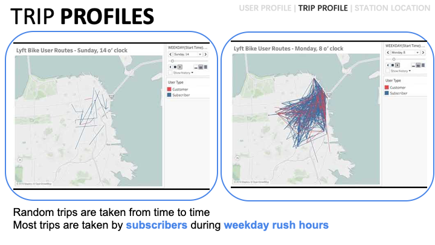

# Explore-Bike-User-Behavior-through-Visualization

## Overview:
The target audience is the lyft bike management team.
This visualization is intended to explore the user behavior patterns, draw some insights from it, and then support business decisions (i.e. advertising target, station location choices) that the lyft bike management team might be interested in.

In this visualization, the audience can first discover about the user route pattern through a video played. Then, a more clear and detailed presentation about the user profile, the station locations and user behavior pattern (trip profile) information (gender, age, and ...) will be presented. After presenting these visualizations, an conclusion comes to warp up and re-emphasize the key takeaways that the viewers are expected to leave with. 

## Slides
[Google Slide Link >>>](https://docs.google.com/presentation/d/1UAKWnpwJTZLgL8yOhoF2A6--zn3kOHTT9NO61idijaY/edit?usp=sharing)

## Techniques employed:

### Visual Narrative - Visual Structuring
• Establishing Shot / Splash Screen : In the first page I put a photo selected from the
website of Lyft bike, which let the audience immediately get involved in the story
that they are about to listen to.
• "Checklist" Progress Tracker I put a "checklist" page right after the first page and it
appears on the top left of each page, which can let the audience have an idea of which part of the story they are listening to and what is expected to come.

### Narrative Structures Ordering
• Linear: This presentation is ordered linearly to give the audience a structured and
controlled set of information that is intended to be conveyed. Interactivity
• Hover Highlighting / Details: Keywords are highlighted by color and bold to capture the audience's attention.
• Filtering / Selection / Search Messaging
• Captions / Headlines & Annotations: used throughout the presentation
• Multi-Messaging: through color and radius presented in the visualisations
• Introductory Text: put in the first page
• Comment Repetition & Summary / Synthesis: used to emphasize the key takeaways.

